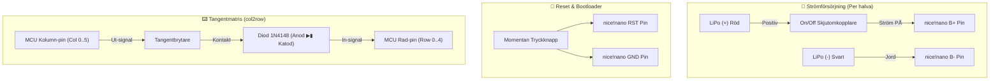
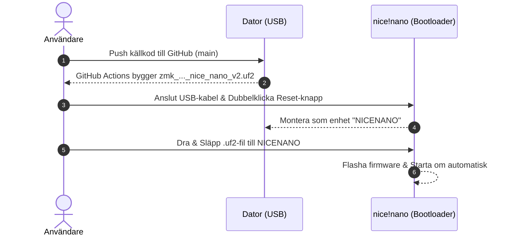

# ZMK Firmware Configuration for Dactyl Manuform (Svorak - 52 Keys)

> [!NOTE]
> Detta arkiv innehåller ZMK firmware-konfiguration för ett delat **Dactyl Manuform** mekaniskt tangentbord (52 tangenter) med **nice!nano v2** mikrokontrollers och **Svorak** (svensk Dvorak) tangentbordsschema.

---

## 📌 Hårdvarulayout & Struktur

Tangentsättningen består av **52 tangenter** (26 tangenter per halva):
- **Huvudgrid**: 3 rader × 6 kolumner = 18 tangenter per halva.
- **Extra fingertangenter**: 2 tangenter nertill under lång- och ringfingrarna (kolumn 2 och kolumn 3).
- **Tumkluster**: 6 tumtangenter per halva.

---

## ⚡ Kopplingsschema & Elektrisk Översikt (Schematics)

### 1. Översikt över Elektriska Anslutningar



---

### 2. Diod- & Matriskoppling (`col2row`)

```text
       [ MCU Kolumn-pin ]  (t.ex. Col 0 - Pin 19)
               │
               ▼
       ┌───────────────┐
       │  Brytare (SW) │
       └───────┬───────┘
               │
               ▼  (Anod)
        ┌─────────────┐
        │ Diod 1N4148 │  ▮ Katod (Svart streck på dioden)
        └──────┬──────┘
               │
               ▼
        [ MCU Rad-pin ]   (t.ex. Row 0 - Pin 4)
```

> [!IMPORTANT]
> Dioderna **måste** lödas med katoden (sidan med det svarta strecket) pekad mot **radledningen** (MCU Row pin) för att `col2row`-skanningen skall fungera korrekt.

---

### 3. Pinout-Tabell för nice!nano v2 (Pro Micro Footprint)

```text
                        ┌───┬───┐
            (TX0) P0.06 │1  │ 24│ RAW (P0.31 - Col 0)
            (RX1) P0.08 │2  │ 23│ GND
                  GND   │3  │ 22│ RST
                  GND   │4  │ 21│ VCC (3.3V)
      (Row 0) P0.06 (4) │5  │ 20│ P0.29 (18 - Col 1)
      (Row 1) P0.08 (5) │6  │ 19│ P0.02 (15 - Col 2)
      (Row 2) P0.17 (6) │7  │ 18│ P1.15 (14 - Col 3)
      (Row 3) P0.20 (7) │8  │ 17│ P1.13 (16 - Col 4)
      (Row 4) P0.22 (8) │9  │ 16│ P0.10 (10 - Col 5)
            (P0.24) (9) │10 │ 15│ P0.09
                (16/A3) │11 │ 14│ (15/A1)
                (10/VCC)│12 │ 13│ (14/A2)
                        └───┴───┘
```

| Matrissteg | Pro Micro Pin | nice!nano GPIO Pin | Anslutning |
| :--- | :--- | :--- | :--- |
| **Row 0** | Pin 4 | `P0.06` | Översta bokstavsraden |
| **Row 1** | Pin 5 | `P0.08` | Hemraden (Home row) |
| **Row 2** | Pin 6 | `P0.17` | Nedersta bokstavsraden |
| **Row 3** | Pin 7 | `P0.20` | Extra tangenter nertill (lång- & ringfinger) |
| **Row 4** | Pin 8 | `P0.22` | Tumkluster (6 tumtangenter) |
| **Col 0** | Pin 19 (RAW) | `P0.31` | Kolumn 0 (längst till vänster) |
| **Col 1** | Pin 18 (A0) | `P0.29` | Kolumn 1 |
| **Col 2** | Pin 15 (A1) | `P0.02` | Kolumn 2 (Ringfinger) |
| **Col 3** | Pin 14 (A2) | `P1.15` | Kolumn 3 (Långfinger) |
| **Col 4** | Pin 16 (A3) | `P1.13` | Kolumn 4 |
| **Col 5** | Pin 10 | `P0.10` | Kolumn 5 (längst till höger) |

---

## 🚀 Installation av Firmware på nice!nano



### Steg-för-steg Flashing
1. **Ladda ner firmware**: Hämta `zmk_x6_manuform_left_nice_nano_v2.uf2` och `zmk_x6_manuform_right_nice_nano_v2.uf2` från **Actions** i ditt GitHub-repository.
2. **Vänster halva (Central)**:
   - Koppla in vänster nice!nano via USB-C.
   - Dubbelklicka på reset-knappen tills disken **`NICENANO`** visas.
   - Kopiera över `zmk_x6_manuform_left_nice_nano_v2.uf2`.
3. **Höger halva (Peripheral)**:
   - Koppla in höger nice!nano via USB-C.
   - Dubbelklicka på reset-knappen tills disken **`NICENANO`** visas.
   - Kopiera över `zmk_x6_manuform_right_nice_nano_v2.uf2`.

---

## 💻 USB vs Bluetooth-anslutning

- **Vänster halva (Central)** skickar automatiskt alla knapptryckningar över **USB** när USB-kabeln är ansluten till datorn.
- **Höger halva (Peripheral)** kommunicerar trådlöst med vänster halva via **BLE Split**.

---

## ⌨️ Keymap Layout (52 Tangenter)

### Lager 0: Bokstäver (Svorak Layout)

```text
LEFT HALF                                                               RIGHT HALF
┌───────┬───────┬───────┬───────┬───────┬───────┐       ┌───────┬───────┬───────┬───────┬───────┬───────┐
│  TAB  │   Å   │   Ä   │   Ö   │   P   │   Y   │       │   F   │   G   │   C   │   R   │   L   │ BSPC  │
├───────┼───────┼───────┼───────┼───────┼───────┤       ├───────┼───────┼───────┼───────┼───────┼───────┤
│ LCTRL │   A   │   O   │   E   │   U   │   I   │       │   D   │   H   │   T   │   N   │   S   │   -   │
├───────┼───────┼───────┼───────┼───────┼───────┤       ├───────┼───────┼───────┼───────┼───────┼───────┤
│ LSHFT │   ,   │   .   │   J   │   K   │   X   │       │   B   │   M   │   W   │   V   │   Z   │ RSHFT │
└───────┴───────┼───────┼───────┼───────┴───────┘       └───────┴───────┼───────┼───────┼───────┴───────┘
                │ LEFT  │ DOWN  │                                       │  UP   │ RIGHT │
                └───┬───┴───┬───┘                                       └───┬───┴───┬───┘
┌───────┬───────┬───┴───┬───┴───┬───────┬───────┐       ┌───────┬───────┬───┴───┬───┴───┬───────┬───────┐
│ BSPC  │  DEL  │  ESC  │ SYMB  │ NUMS  │ LALT  │       │ NUMS  │ SYMB  │ RCTRL │ SPACE │  RET  │  TAB  │
└───────┴───────┴───────┴───────┴───────┴───────┘       └───────┴───────┴───────┴───────┴───────┴───────┘
```

---

### Lager 1: Symboler (`&mo 1`)

```text
LEFT HALF                                                               RIGHT HALF
┌───────┬───────┬───────┬───────┬───────┬───────┐       ┌───────┬───────┬───────┬───────┬───────┬───────┐
│   `   │   !   │   @   │   #   │   $   │   %   │       │   ^   │   &   │   *   │   (   │   )   │  DEL  │
├───────┼───────┼───────┼───────┼───────┼───────┤       ├───────┼───────┼───────┼───────┼───────┼───────┤
│       │   {   │   }   │   (   │   )   │   &   │       │   -   │   =   │   :   │   ;   │   '   │   "   │
├───────┼───────┼───────┼───────┼───────┼───────┤       ├───────┼───────┼───────┼───────┼───────┼───────┤
│       │   [   │   ]   │   <   │   >   │   |   │       │   \   │   +   │   ,   │   .   │   /   │       │
└───────┴───────┼───────┼───────┼───────┴───────┘       └───────┴───────┼───────┼───────┼───────┴───────┘
                │ HOME  │  END  │                                       │ PG_UP │ PG_DN │
                └───┬───┴───┬───┘                                       └───┬───┴───┬───┘
┌───────┬───────┬───┴───┬───┴───┬───────┬───────┐       ┌───────┬───────┬───┴───┬───┴───┬───────┬───────┐
│       │       │       │       │       │       │       │       │       │       │ SPACE │  RET  │       │
└───────┴───────┴───────┴───────┴───────┴───────┘       └───────┴───────┴───────┴───────┴───────┴───────┘
```

---

### Lager 2: Siffror, Navigation & System (`&mo 2`)

```text
LEFT HALF                                                               RIGHT HALF
┌───────┬───────┬───────┬───────┬───────┬───────┐       ┌───────┬───────┬───────┬───────┬───────┬───────┐
│  ESC  │  F1   │  F2   │  F3   │  F4   │  F5   │       │   7   │   8   │   9   │   +   │   -   │ BSPC  │
├───────┼───────┼───────┼───────┼───────┼───────┤       ├───────┼───────┼───────┼───────┼───────┼───────┤
│       │  F6   │  F7   │  F8   │  F9   │  F10  │       │   4   │   5   │   6   │   *   │   /   │  RET  │
├───────┼───────┼───────┼───────┼───────┼───────┤       ├───────┼───────┼───────┼───────┼───────┼───────┤
│  USB  │  BLE  │  TOG  │ BTCLR │ BTSEL0│ BTSEL1│       │   1   │   2   │   3   │   =   │   .   │       │
└───────┴───────┼───────┼───────┼───────┴───────┘       └───────┴───────┼───────┼───────┼───────┴───────┘
                │ LEFT  │ DOWN  │                                       │  UP   │ RIGHT │
                └───┬───┴───┬───┘                                       └───┬───┴───┬───┘
┌───────┬───────┬───┴───┬───┴───┬───────┬───────┐       ┌───────┬───────┬───┴───┬───┴───┬───────┬───────┐
│       │       │       │       │       │       │       │       │       │       │   0   │   .   │       │
└───────┴───────┴───────┴───────┴───────┴───────┘       └───────┴───────┴───────┴───────┴───────┴───────┘
```
